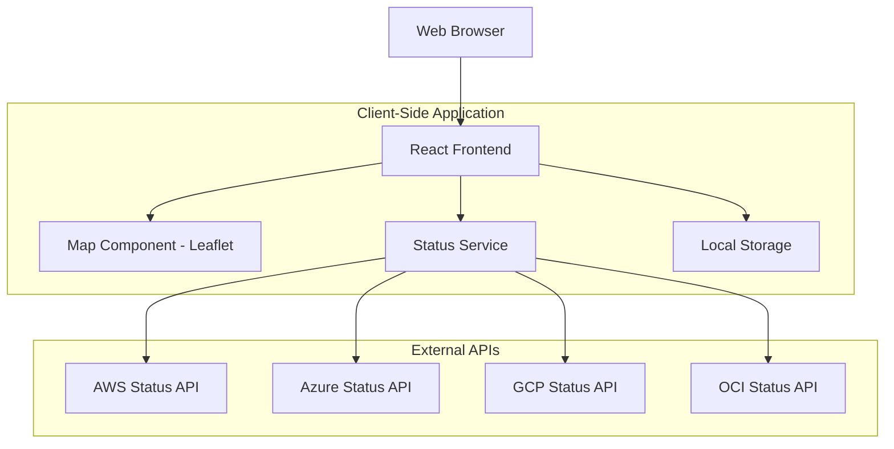

# Cloud Status Dashboard Design Document

## Overview

The Cloud Status Dashboard is a web-based application that provides real-time visualization of cloud provider service health across global regions. The system uses an interactive map interface with color-coded regions to indicate service status, supports drill-down capabilities for detailed incident information, and automatically refreshes data from public cloud provider status feeds every 15 minutes.

The application follows a client-side architecture for the local version with localStorage persistence, and can be extended to a traditional 3-tier architecture for production deployment.

## Architecture

### High-Level Architecture



### Technology Stack

**Frontend Framework:** React 18 with TypeScript
- Provides component-based architecture and strong typing
- Excellent ecosystem for mapping and UI components

**Mapping Library:** Leaflet with React-Leaflet
- Open-source, lightweight mapping solution
- Extensive plugin ecosystem for custom overlays
- Good performance for real-time updates

**State Management:** React Context + useReducer
- Sufficient for application complexity
- localStorage integration for persistence

**Styling:** Tailwind CSS
- Utility-first approach for responsive design
- Easy customization for large screen displays

**HTTP Client:** Axios
- Promise-based HTTP client with interceptors
- Built-in request/response transformation

## Components and Interfaces

### Core Components

#### 1. MapContainer Component
```typescript
interface MapContainerProps {
  regions: CloudRegion[];
  selectedRegion?: CloudRegion;
  onRegionClick: (region: CloudRegion) => void;
  onMapClick: () => void;
}
```

**Responsibilities:**
- Renders the interactive world map using Leaflet
- Displays cloud provider regions as colored overlays
- Handles zoom levels and region/AZ visibility
- Manages map interactions and events

#### 2. RegionOverlay Component
```typescript
interface RegionOverlayProps {
  region: CloudRegion;
  status: ServiceStatus;
  onClick: (region: CloudRegion) => void;
}
```

**Responsibilities:**
- Renders individual region boundaries on the map
- Applies color coding based on service health status
- Handles region click events

#### 3. RegionalView Component
```typescript
interface RegionalViewProps {
  region: CloudRegion;
  services: ServiceHealth[];
  onServiceClick: (service: ServiceHealth) => void;
  onClose: () => void;
}
```

**Responsibilities:**
- Displays services within a selected region
- Groups services by cloud provider
- Shows high-level status for each service

#### 4. IncidentPanel Component
```typescript
interface IncidentPanelProps {
  incident: ServiceIncident;
  isOpen: boolean;
  onClose: () => void;
}
```

**Responsibilities:**
- Slides in from the right side of the screen
- Displays detailed incident information
- Handles panel open/close animations

#### 5. StatusService
```typescript
interface StatusService {
  fetchAllProviderStatus(): Promise<ProviderStatus[]>;
  fetchAWSStatus(): Promise<AWSStatus>;
  fetchAzureStatus(): Promise<AzureStatus>;
  fetchGCPStatus(): Promise<GCPStatus>;
  fetchOCIStatus(): Promise<OCIStatus>;
}
```

**Responsibilities:**
- Manages API calls to cloud provider status endpoints
- Normalizes data from different provider formats
- Implements retry logic and error handling
- Caches responses to reduce API calls

### Data Models

#### CloudRegion
```typescript
interface CloudRegion {
  id: string;
  name: string;
  provider: CloudProvider;
  coordinates: {
    latitude: number;
    longitude: number;
  };
  boundaries: GeoJSON.Polygon;
  availabilityZones?: AvailabilityZone[];
  services: string[];
}
```

#### ServiceHealth
```typescript
interface ServiceHealth {
  serviceName: string;
  provider: CloudProvider;
  region: string;
  status: 'operational' | 'degraded' | 'outage';
  incidents: ServiceIncident[];
  lastUpdated: Date;
}
```

#### ServiceIncident
```typescript
interface ServiceIncident {
  id: string;
  title: string;
  description: string;
  severity: 'low' | 'medium' | 'high' | 'critical';
  affectedServices: string[];
  startTime: Date;
  endTime?: Date;
  status: 'investigating' | 'identified' | 'monitoring' | 'resolved';
  updates: IncidentUpdate[];
}
```

### Public API Endpoints

#### AWS Service Health Dashboard
- **URL:** `https://status.aws.amazon.com/rss/all.rss`
- **Format:** RSS/XML
- **Update Frequency:** Real-time
- **Regions:** Global AWS regions

#### Azure Status
- **URL:** `https://status.azure.com/en-us/status/feed/`
- **Format:** RSS/XML
- **Update Frequency:** Real-time
- **Regions:** Global Azure regions

#### Google Cloud Status
- **URL:** `https://status.cloud.google.com/incidents.json`
- **Format:** JSON
- **Update Frequency:** Real-time
- **Regions:** Global GCP regions

#### Oracle Cloud Infrastructure
- **URL:** `https://ocistatus.oraclecloud.com/api/v2/incidents.json`
- **Format:** JSON
- **Update Frequency:** Real-time
- **Regions:** Global OCI regions

## Error Handling

### API Error Handling
1. **Network Failures:** Implement exponential backoff retry logic
2. **Rate Limiting:** Respect provider rate limits with appropriate delays
3. **Data Parsing Errors:** Log errors and use cached data when available
4. **CORS Issues:** Implement proxy endpoints for development if needed

### User Experience Error Handling
1. **Loading States:** Show loading indicators during data fetches
2. **Error Messages:** Display user-friendly error messages for failures
3. **Graceful Degradation:** Continue showing last known good data
4. **Offline Support:** Cache data in localStorage for offline viewing

### Error Recovery Strategies
```typescript
interface ErrorRecoveryConfig {
  maxRetries: number;
  retryDelay: number;
  fallbackToCache: boolean;
  userNotification: boolean;
}
```

## Testing Strategy

### Unit Testing
- **Framework:** Jest + React Testing Library
- **Coverage:** All components, services, and utility functions
- **Mock Strategy:** Mock external API calls and localStorage

### Integration Testing
- **Map Interactions:** Test region clicking and zoom functionality
- **Data Flow:** Test data fetching and state updates
- **UI Interactions:** Test panel opening/closing and navigation

### End-to-End Testing
- **Framework:** Playwright or Cypress
- **Scenarios:** 
  - Full user journey from map view to incident details
  - Auto-refresh functionality
  - Large screen display behavior
  - Error handling scenarios

### Performance Testing
- **Map Rendering:** Test with large numbers of regions
- **Memory Usage:** Monitor for memory leaks during auto-refresh
- **Load Testing:** Simulate multiple concurrent users

## Implementation Considerations

### Responsive Design
- **Breakpoints:** Mobile (768px), Tablet (1024px), Desktop (1280px), Large Display (1920px+)
- **Map Scaling:** Adjust region sizes and text based on screen size
- **Touch Support:** Ensure touch interactions work on tablet displays

### Performance Optimization
- **Region Clustering:** Group nearby regions at lower zoom levels
- **Lazy Loading:** Load region details only when needed
- **Caching Strategy:** Cache API responses with appropriate TTL
- **Bundle Optimization:** Code splitting for map components

### Accessibility
- **Keyboard Navigation:** Support keyboard-only navigation
- **Screen Readers:** Provide appropriate ARIA labels
- **Color Contrast:** Ensure sufficient contrast for status colors
- **Alternative Text:** Provide text alternatives for visual status indicators

### Browser Compatibility
- **Target Browsers:** Chrome 90+, Firefox 88+, Safari 14+, Edge 90+
- **Polyfills:** Include necessary polyfills for older browsers
- **Feature Detection:** Graceful degradation for unsupported features

### Security Considerations
- **CORS Handling:** Implement proper CORS policies
- **Data Sanitization:** Sanitize all external API data
- **XSS Prevention:** Use React's built-in XSS protection
- **Content Security Policy:** Implement appropriate CSP headers